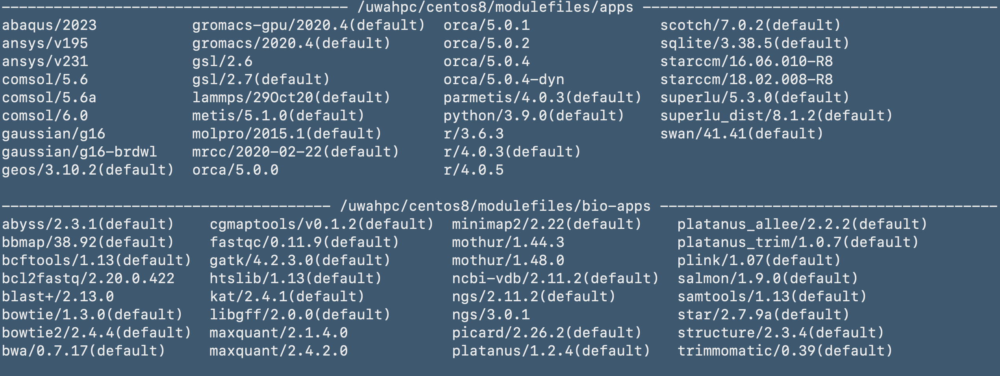
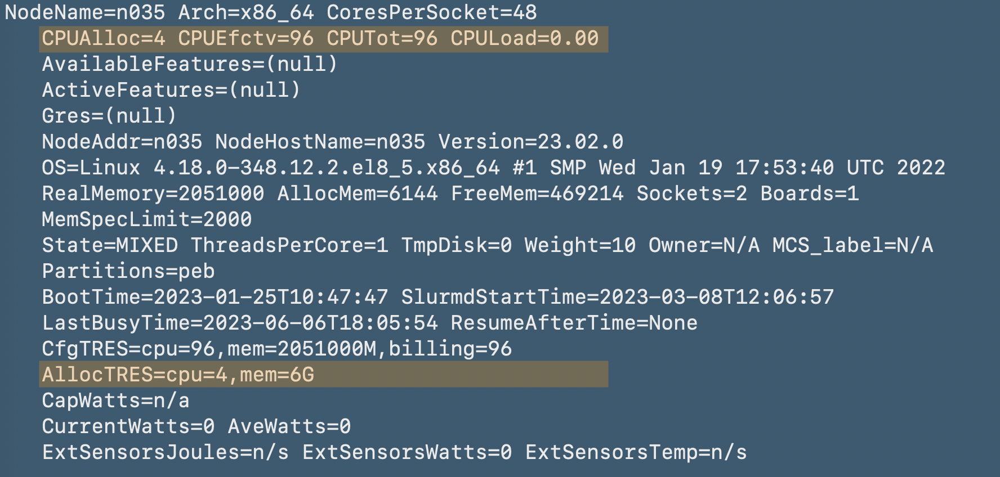

# Kaya Server Usage and SLURM Scheduling Tutorial for Lister Lab

This repository contains a tutorial on server usage and SLURM scheduling. The tutorial provides an introduction to server management and demonstrates how to use SLURM for job scheduling.

## Table of Contents

- [Introduction](#introduction)
- [Prerequisites](#prerequisites)
- [Installation](#installation)
- [Usage](#usage)
- [Examples](#examples)
- [Contributing](#contributing)
- [License](#license)

## Introduction

In this tutorial, you will learn the basics of server management and SLURM job scheduling. The tutorial is designed for beginners and covers the following topics:

- What is a server?
- Why use SLURM for job scheduling?
- How to set up and configure a server.
- How to submit and manage jobs using SLURM.
- Best practices and tips for efficient server usage.

## Prerequisites

Before starting with the tutorial, make sure you have the following prerequisites installed:

- Access to UWA's Kaya server. Email David Grey at UWA for access. 
  * Importantly, you'll need to have a description of your project and who else will have access to the data.
- VPN access to UWA, including setup of MS Authenticator in case you work outside of the `UNIFI` network.
- Test that you could successfully login to `Kaya` by opening the terminal and ssh into Kaya


```bash
ssh <username>@kaya.hpc.uwa.edu.au
```


## Installation

There are lot couple of programs already pre-installed on `Kaya`. They are called `modules` and you can access the available modules by typeing:

```bash
module avail
```




You can work out what modules you have loaded with the command

```bash
module list
```

__IMPORTANTLY__, you'll need to load the `gcc` compiler for a lot of the programs. Consider adding this line of code to your `~/.bashrc` file.

You can load a module with the command

```bash
module load gcc/9.4.0
```

To load samtools for example, type either
```bash
module load samtools/1.13(default)
```
or
```bash
module load samtools
```

Try running `module list` to check if `samtools` have been successfully loaded.


If you must, you can also unload the modules (in case they clash with conda installs for example) with the command

```bash
module unload samtools
```

### Conda installations

__Conda__ is already pre-installed on `Kaya`. In order to use `conda`, load the module

```bash
module load Anaconda3/2021.05
```

It's recommended and important to install your `conda environment` with the prefix to point to the `group` data. There is more space on the `/group` volume and you can easily share the conda installation with your team members, so they don't have to re-install everything themselves.

An example of how to create a new conda environment would be:

```bash
conda create -p /group/<your_project_name>/conda_environments/bioinfo -c conda-forge mamba
```
Mamba is really useful for quicker installations in conda by replacing `conda` with `mamba`. For example, after mamba is installed, you can install `unicycler` with `mamba` by typing

```bash
mamba install -c bioconda unicycler
```


Once you have setup your conda environment, it's as easy as loading it by executing

```bash
conda activate /group/<your_project_name>/conda_environments/bioinfo
```

You should consider adding your default conda environment to your `~/.bashrc` so you can use your favourite programs right away.


## Usage

### 1. Copy files over to Kaya

You can use either [Filezilla](https://filezilla-project.org) or good old `scp` to copy over files to *Kaya*. For example, you could log into the *PEB* servers and `scp` the tutorial folder.
 
 ```bash
 scp -r /dd_groupdata/tutorial_kaya/ <username>@kaya.hpc.uwa.edu.au:~
 ```
 
 ### 2. Check resources on the Kaya HPC cluster
 
 Kaya uses SLURM scheduling and you have a couple of options to check what's available and how the queues look like. The graphical interface that tracks usage of resources can be found [here](https://monitor.hpc.uwa.edu.au/d/LftKgZm4z/server-metrics-single?orgId=2&refresh=1m&var-DS_PROMETHEUS=default&var-job=node&var-node=n035.hpc.uwa.edu.au:9100&var-diskdevices=%5Ba-z%5D%2B%7Cnvme%5B0-9%5D%2Bn%5B0-9%5D%2B). 
 
 The Lister Lab server is reserved at __node n035__.
 
 Therefore, you can check the resources that are being used with
 
 ```bash
 scontrol show node n035
 ```
 
 
 
 You can see from the picture above, that 4 *cores* are in use and therefore 92 *cores* are available at that time.
 
 To check the queue for the ListerLab server, use the command
 
 ```bash
 squeue -p peb
 ```
 
 or for you own jobs
 
 ```bash
 squeue -u <username>
 ```
 
 __Note__ at the time of writing, the ListerLab server has the partion variable `peb` assigned. This will change in the future and this Tutorial needs to be updated.
 
 
 Check progress on your jobs
 
 ```bash
 sacct
 ```

In case the ListerLab server is fully utilized, you'll also have access to common Kaya servers. To list them run

```bash
sinfo --noheader --format="%P"
```

The available partitions have the following wall-time limits
| Partition  | Time Limit      | Publicly Available         |
|------------|-----------------|----------------------------|
| work       | 3-00:00:00      | yes                        |
| long       | 7-00:00:00      | yes                        |
| gpu        | 3-00:00:00      | yes                        |
| test       | 00:15:00        | yes                        |
| ondemand   | 04:00:00        | yes                        |
| peb        | 14-00:00:00     | no - ListerLab exclusive   |

### 3. Interactive sessions

To test and develop your code/pipeline/environment, it's benefitial to request an interactive session. You can do so by running

```bash
srun \
--time=1:00:00 \
--account=<username> \
--partition=peb \
--nodes=1 \
--ntasks=1 \
--cpus-per-task=4 \
--mem-per-cpu=5G \
--pty /bin/bash -l
```
to request a `1h` session with `4 cores` and `20GB of RAM` in total.  

## Examples

Provide some examples or use cases to demonstrate the concepts explained in the tutorial. You can include sample code or scripts along with explanations.

## Contributing

Contributions to this tutorial are welcome! If you find any issues or have suggestions for improvement, please open an issue or submit a pull request.

## License

This project is licensed under the [License Name] - add a link to the license file if applicable.
