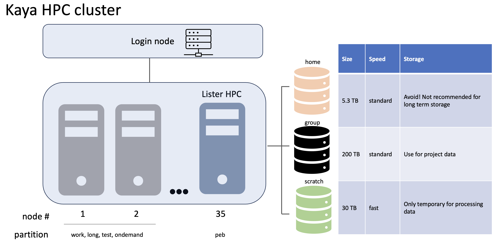

# Kaya Server Usage and SLURM Scheduling Tutorial for Lister Lab

This repository contains a tutorial on server usage and SLURM scheduling. The tutorial provides an introduction to server management and demonstrates how to use SLURM for job scheduling.

## Table of Contents

- [Introduction](#introduction)
- [Prerequisites](#prerequisites)
- [Installation](#installation)
- [Usage](#usage)
- [Examples](#examples)
- [Contributing](#contributing)
- [License](#license)

## Introduction

In this tutorial, you will learn the basics of server management and SLURM job scheduling. The tutorial is designed for beginners and covers the following topics:

- What is a server?
- Why use SLURM for job scheduling?
- How to set up and configure a server.
- How to submit and manage jobs using SLURM.
- Best practices and tips for efficient server usage.

### Kaya server architecture and storage schematic



## Prerequisites

Before starting with the tutorial, make sure you have the following prerequisites installed:

☑️ Access to UWA's Kaya server. Email David Grey at UWA for access. 
  * Importantly, you'll need to have a description of your project and who else will have access to the data.
  
☑️ VPN access to UWA, including setup of MS Authenticator in case you work outside of the `UNIFI` network.

☑️ Test that you could successfully login to `Kaya` by opening the terminal and ssh into Kaya


```bash
ssh <username>@kaya.hpc.uwa.edu.au
```

This will allow you to login to Kaya's head node. It is *paramount* that you don't run programs on the head node as it is configured to install programs, write scripts and submit SLURM scripts to the SLURM scheduler. Even compressing a file on the head node can cause issues - it is not designed for any heavy duty tasks.  


## Installation

You do not have admin (`sudo`) access to `Kaya` so you are limited in what and how you can install and use software. There are a lot of programs already pre-installed on `Kaya`. They are called `modules` and you can access the available modules by typeing:

```bash
module avail
```


You can work out what modules you have loaded with the command (by default you will not have any)

```bash
module list
```

You can load a module with the command

```bash
module load gcc/9.4.0
```

__IMPORTANTLY__, you'll need to load the `gcc` compiler for a lot of the programs. Consider adding this line of code to your `~/.bashrc` file by login into `Kaya` and excecute `nano ~/.bashrc`. Paste `module load gcc/9.4.0` in a new line and then save your `~/.bashrc` before you exit. You can reload your profile by executing `source ~/.bashrc`. 

To load samtools for example, type either
```bash
module load samtools/1.13
```
or
```bash
module load samtools
```

Try running `module list` to check if `samtools` have been successfully loaded.


If you must, you can also unload the modules (in case they clash with conda installs for example) with the command

```bash
module unload samtools
```

### Conda installations

__Conda__ is already pre-installed on `Kaya`. In order to use `conda`, load the module

```bash
module load Anaconda3/2021.05
```

It's recommended and important to create a new `conda environment` with the prefix to point to the `group` data. There is more space on the `/group` volume and you can easily share the conda installation with your team members, so they don't have to re-install everything themselves.

An example of how to create a new conda environment would be:

```bash
conda create -p /group/<your_project_name>/conda_environments/bioinfo -c conda-forge mamba
```
Mamba is really useful for quicker installations in conda by replacing `conda` with `mamba`. For example, after mamba is installed, you can install `unicycler` with `mamba` by typing

```bash
mamba install -c bioconda unicycler
```


Once you have setup your conda environment, it's as easy as loading it by executing

```bash
conda activate /group/<your_project_name>/conda_environments/bioinfo
```

You should consider adding a default conda environment to your `~/.bashrc` so you can use your favourite programs right away (it is best practice to not install anything into the conda default enviroment `base` as this can cause unexpected behaviour that is hard to resolve).


## Usage

### 1. Copy files over to Kaya

You can use either [Filezilla](https://filezilla-project.org) or good old `scp` to copy over files to *Kaya*. For example, you could log into the old *PEB* servers and `scp` the tutorial folder.
 
 ```bash
 scp -r /dd_groupdata/tutorial_kaya/ <username>@kaya.hpc.uwa.edu.au:~
 ```
 
 ### 2. Check resources on the Kaya HPC cluster
 
 Kaya uses SLURM scheduling and you have a couple of options to check what's available and how the queues look like. The graphical interface that tracks usage of resources can be found [here](https://monitor.hpc.uwa.edu.au/d/LftKgZm4z/server-metrics-single?orgId=2&refresh=1m&var-DS_PROMETHEUS=default&var-job=node&var-node=n035.hpc.uwa.edu.au:9100&var-diskdevices=%5Ba-z%5D%2B%7Cnvme%5B0-9%5D%2Bn%5B0-9%5D%2B). 
 
 The Lister Lab server is reserved at __node n035__.
 
 Therefore, you can check the resources that are being used with
 
 ```bash
 scontrol show node n035
 ```
 
 
 
 You can see from the picture above, that 4 *cores* are in use and therefore 92 *cores* are available at that time.
 
 To check the queue for the ListerLab server, use the command
 
 ```bash
 squeue -p peb
 ```
 
 or for you own jobs
 
 ```bash
 squeue -u <username>
 ```
 
 __Note__ at the time of writing, the ListerLab server has the partion variable `peb` assigned. This will change in the future and this Tutorial needs to be updated.
 
 
 Check progress on your jobs
 
 ```bash
 sacct
 ```

To check the the jobs over the last week and see the memory usage (maxRSS) in GB use 

```bash
sacct --starttime $(date -d "1 week ago" +%Y-%m-%d) --format=JobID,JobName,State,Elapsed,MaxRSS | awk '{ if ($5 ~ /^[0-9]+K$/) { sub(/K$/, "", $5); printf "%s %s %s %s %.2fGB\n", $1, $2, $3, $4, $5/1024/1024 } else { print } }'
```

In case the ListerLab (PEB) node is fully utilized, you'll also have access to common Kaya nodes. To list them run

```bash
sinfo --noheader --format="%P"
```

Partitions are like tags on different nodes within Kaya that mark them as appropiate for specific types of jobs. Not all of the nodes have a GPU, so the GPU partitions only includes nodes that have them. The PEB partitions allows for a longer time limit for jobs because we bought the machine and specifically requested this feature. The available partitions have the following wall-time limits
| Partition  | Time Limit (D-HH:MM:SS) | Publicly Available | Description        |
|------------|-----------------|----------------------------|--------------------|
| work       | 3-00:00:00     | yes                        | For fairly long tasks (TopHat read mapping)       |
| long       | 7-00:00:00     | yes                        | For very long tasks (loop of TopHat read mapping) |
| gpu        | 3-00:00:00     | yes                        | For GPU intensive tasks                           |
| test       | 00:15:00       | yes                        | For very short test of programs or scripts        |
| peb        | 14-00:00:00    | no - ListerLab exclusive   | For very long tasks (like interactive R sessions) |

### 3. Interactive sessions

To test and develop your code/pipeline/environment, it's benefitial to request an interactive session. You can do so by running

```bash
srun \
--time=1:00:00 \
--account=<username> \
--partition=peb \
--nodes=1 \
--ntasks=1 \
--cpus-per-task=4 \
--mem-per-cpu=5G \
--pty /bin/bash -l
```
to request a `1h` session with `4 cores` and `20GB of RAM` in total.  

__IMPORTANTLY__ exit the session by typing `exit` in the terminal to free up resources ❗

__IMPORTANTLY__ Unlike the old PEB servers, this interactive session will wall off resources so even if you are not using them, no one else can, so be polite and exit when you don't need it ❗

## Examples


### 1. SLURM script syntax

SLURM scripts are essentially bash scripts with a header that indicates what the SLURM scheduler is supposed to do for you. For example it needs to know what resources your scripts require such as

- time
- CPUs
- memory
- which node(s) (partition) should handle your script.

The way you can specify this is by adding the following lines to your SLURM script:

```bash
#!/bin/bash --login

#SBATCH --job-name=<map_da_reads>
#SBATCH --partition=peb
#SBATCH --mem-per-cpu=10G
#SBATCH --nodes=1
#SBATCH --ntasks=1
#SBATCH --cpus-per-task=8
#SBATCH --time=4:00:00   
#SBATCH --export=NONE
#SBATCH --mail-user=<uwa_email_address>@uwa.edu.au
#SBATCH --mail-type=BEGIN,END

```

This is followed by setting some variable names so you can track which `SLURM` job has resulted in what `output` (above and below is all intended to be in one script).

```bash
# Start of job
echo $JOBNAME job started at  `date`

# To compile with the GNU toolchain
module load gcc/9.4.0
module load star/2.7.9a
module load Anaconda3/2020.11
conda activate /group/<your_project_name>/conda_environments/bioinfo

# leave in, it lists the environment loaded by the modules
module list

#  Note: SLURM_JOBID is a unique number for every job.
#  These are generic variables
JOBNAME=GRCm39_ERCC_STAR_index
SCRATCH=$MYSCRATCH/$JOBNAME/$SLURM_JOBID
RESULTS=$MYGROUP/$JOBNAME/$SLURM_JOBID

```

### 2. Example SLURM scripts

Now let's run some SLURM scripts and change them so you can see how they work.

☑️ Login to Kaya and download the tutorial by executing `git clone https://github.com/cpflueger2016/Kaya-ListerLab-Tutorial`.

### 3. Launch a SLURM script

```bash
sbatch -p peb SLURM_scripts/SLURM_tutorial_fastp.sh
```

### 4. Cancel SLURM scripts that have an issue or that are in the queue

```bash
scancel <SLURM_JOB_ID>
```


## Contributing

Contributions to this tutorial are welcome! If you find any issues or have suggestions for improvement, please open an issue or submit a pull request.

## License

This project is licensed under the [License Name] - add a link to the license file if applicable. 

Tutorial intitally written by Christian Pflueger. Some edits from James Lloyd. 
